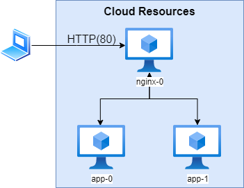

# Aspen Take Home Project 
This project is for implementing the Aspen Capital take home project defined [here](https://github.com/aspencapital/candidate-project-sre]).


## Project Overview
This project uses AWS' Cloud Development Kit (cdk) implemented in Python to provision a single EC2 instance with the following architecture: 



This project consists of three main components - the provided express application, the NGINX load balancer and CDK for deploying and provisiong the project.


## Implementation Explaination 
Due to the requirements of a single nginx reverse proxy forwarding to two instances of the application, EC2 seems like the best choice for this implementation.  If we needed multiple instances with each having their own reverse proxy, an ECS with a sidecar implementation would have been a better choice. ECS excells in providing it's own load balancing with multiple instances of the same container (app in this case), so NGINX would have been redundant and the sidecar implementation would not have fit the requirements.  

Other alternatives considered were using fargate as well as other serverless containerization services. Ultimately, EC2 felt the most appropriate given the requirements and budget constraints as part of this excersize was to utilize the free tier as much as possible to show ability to anaylyze and stay within a budget.  


## Languages and Tools:
The provided app was written in express node.js while the CDK deployment was implemented in python.  I chose to use docker containers for each of the apps and the NGINX instance in order to simplify orchestration using docker compose.  Shell scripts were also used extensively to help with provisioning the deployed system, as well as starting the express app (and keeping the container running), building and deploying the docker images. 

## Pre-Requisites: 
1. Make sure you have [aws-cli](https://aws.amazon.com/cli/) installed and configured before using CDK to deploy the project. 

2. If you want to run the project locally, make sure you have docker and docker-compose installed.


## Getting Started Deploying to AWS:
The general workflow for building and deploying the application to AWS:

1. Clone the project into desired location:

```bash
git clone https://github.com/JaimeLanders/Aspen-Take-Home-Project.git .
```

2. Create .env in the cdk subfolder (.env_example provided for ease) to customize the deployment.  

3. Bootstrap and deploy the application to the desired account and region in the cdk subfolder:

```bash
cd ./cdk
```

```bash
cdk synth
```

```bash
cdk boostrap
```

```bash
cdk deploy
```

4. Tear down the instance

```bash
cdk destroy
```

## Getting Started Deploying Locally:
The general workflow for building and deploying the application locally:

1. To deploy the project locally, first create the docker network:

```bash
sudo docker network create -d bridge aspen
```

2. Then use docker-compose to build and deploy the project in the project root: 

```bash
sudo docker-compose scale app=2 nginx=1
```

3. Next, curl or visit https://localhost or http://localhost in your browser:

```bash
curl -k https://localhost
```

```bash
curl http://localhost
```

4. You should see something similar to the the following in your browser and/or terminal:

```bash
{"hostname":"a7c40351918a","msg":"Hello world!","nodeVersion":"v18.2.0","pid":43,"uptime":7867.478466045}
```

```bash
{"hostname":"4abc1126b96c","msg":"Hello world!","nodeVersion":"v18.2.0","pid":42,"uptime":7876.017861105}
```

**Note** that the hostname is the app container and they will alternate between both containers due to the NGINX load  balancer.

5. To tear down the application, you can run the ```stop.sh``` helper script or run the following commands:

```bash
sudo docker-compose down
```

### Visit the [cdk](https://github.com/JaimeLanders/Aspen-Take-Home-Project/tree/main/cdk) [app](https://github.com/JaimeLanders/Aspen-Take-Home-Project/tree/main/app), [nginx](https://github.com/JaimeLanders/Aspen-Take-Home-Project/tree/main/nginx) and project subfolders for more details and instructions.  